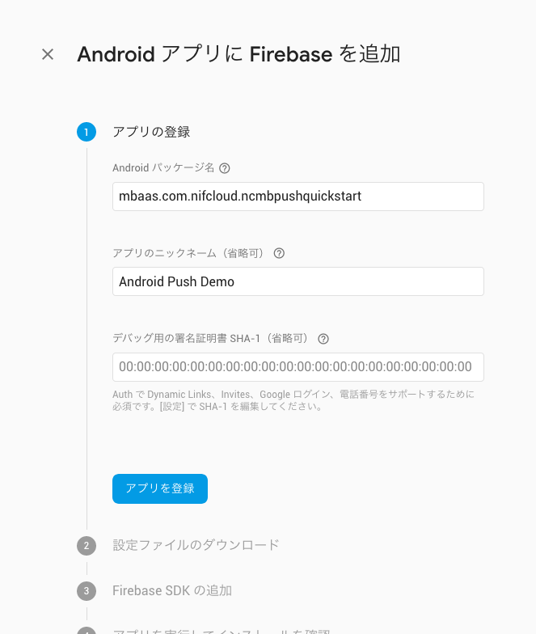

# 【Android】プッシュ通知を組み込もう！
*2016/09/27作成（2018/10/13更新）*

<center></center>

## 概要

* [ニフクラ mobile backend](https://mbaas.nifcloud.com/)のプッシュ通知機能は、Googleが提供しているFirebase Cloud Messaging（以下、FCM）と連携することで、通知の配信を行っています

* Androidアプリでプッシュ通知を受信するまでの設定は以下のような流れとなっています
   * Firebaseプロジェクトの作成とAPIキーの取得 ※APIキーの取得については2019年3月以降廃止予定
   * google-service.jsonとFirebase秘密鍵の設定
   * ニフクラ  mobile backendでの設定
   * アプリでの設定
* 詳しい設定内容は[プッシュ通知（Android）](https://mbaas.nifcloud.com/doc/current/push/basic_usage_android.html)をご参照ください

## ニフクラ mobile backendって何？？
スマートフォンアプリのバックエンド機能（プッシュ通知・データストア・会員管理・ファイルストア・SNS連携・位置情報検索・スクリプト）が**開発不要**、しかも基本**無料**(注1)で使えるクラウドサービス！今回はデータストアを体験します

注1：詳しくは[こちら](https://mbaas.nifcloud.com/price.htm)をご覧ください

<center></center>


## 動作環境
* Windows 7 Professional
* Android Studio v3.1
* Android ver 4x,5x,6x,7x

※上記内容で動作確認をしています

<div style="page-break-before:always"></div>

## 手順
### 0.プッシュ通知機能を使うための準備

 FCM対応したプッシュ通知を送信する場合、Firebaseプロジェクトを作成していただいたあと、下記設定を行っていただく必要があります。
 
 * APIキーの取得※2019年3月以降廃止
 * google-service.jsonをアプリに配置
 * Firebaseプロジェクトの秘密鍵をmobile backendにアップロード
 
 以下のドキュメントを参考に、設定を行ってください。
 
 ▼Firebaseプロジェクトの作成とAPIキーの取得▼  
  https://mbaas.nifcloud.com/doc/current/tutorial/push_setup_android.html  
  ※2019年3月までの間は、Firebaseプロジェクトのサーバーキーもmobile backendにて設定していただく必要があります。  
 
 ▼ google-service.jsonとFirebase秘密鍵の設定方法について▼  
 https://mbaas.nifcloud.com/doc/current/common/push_setup_fcm_json.html  
 ※ [手順5.google-service.jsonの配置](https://github.com/NIFCloud-mbaas/android_push_demo#5-google-servicejson%E3%81%AE%E9%85%8D%E7%BD%AE) もご参考ください。   

### 1. ニフクラ  mobile backend の準備

* [本リンク](https://mbaas.nifcloud.com/signup.htm)から会員登録（無料）をします
* 登録後、ログインをすると下図のように「アプリの新規作成」画面が出ますので、アプリを作成します

<center></center>

* アプリ作成されると下図のような画面になります
* この２種類のAPIキー（アプリケーションキーとクライアントキー）は先ほどインポートしたAndroidStudioで作成するAndroidアプリにニフクラ mobile backendの紐付けるため、あとで使います

<center></center>

* 動作確認後、端末情報が保存される場所（データストアのinstallationクラス）を確認しておきましょう

<center></center>

<div style="page-break-before:always"></div>

* アプリ設定を開いてプッシュ通知の設定をします
   * 「プッシュ通知の許可」で「許可する」選択、「保存する」をクリックします
    * 「Androidプッシュ通知」の「APIキー」には、Firebaseでプロジェクト作成時に発行された「サーバーキー」を記入し、「保存する」をクリックします　※こちらの手順は2019年3月以降廃止予定です
    * 「FCMプッシュ通知」の「FCMプッシュ通知設定ファイルの選択」というボタンをクリックして、 FirebaseからダウンロードしたFirebaseの秘密鍵jsonファイルをアップロードします

<center></center>

### 2. GitHub からサンプルプロジェクトのダウンロード

* プロジェクトの [Github ページ](https://github.com/NIFCloud-mbaas/android_push_demo)から「 Clone or download 」＞「 Download ZIP 」をクリックします
* プロジェクトを解凍します

### 3. AndroidStudio でアプリを起動

* AndroidStudio を開き、解凍したプロジェクトを選択します

<center></center>

<div style="page-break-before:always"></div>

* プロジェクトを開きます

<center></center>

### 4. APIキーの設定

* `MainActivity.java`を編集します
* 先程[ニフクラ mobile backend](https://mbaas.nifcloud.com/)のダッシュボード上で確認したAPIキーを貼り付けます

<center></center>

* それぞれ`YOUR_APPLICATION_KEY`と`YOUR_CLIENT_KEY`の部分を書き換えます
 * このとき、ダブルクォーテーション（`"`）を消さないように注意してください！

### 5. google-service.jsonの配置

* Firebaseから発行したgoogle-service.jsonをアプリに配置します
    * なお、発行時にAndroidパッケージ名は"mbaas.com.nifcloud.ncmbpushquickstart"としてください

  <center></center>
    
    * パッケージ名を別名にした場合はアプリ配置後、google-services.jsonファイル内の"package_name"を"mbaas.com.nifcloud.ncmbpushquickstart"に変更してください

<center></center>

<div style="page-break-before:always"></div>

### 6. 動作確認

* AndroidStudioからビルドする。
 * 「プロジェクト場所」`\app\build\outputs\apk\ ***.apk` ファイルが生成される

* インストールしたアプリを起動します
 * プッシュ通知の許可を求めるアラートが出たら、必ず許可してください！

  <center></center>

* 起動されたらこの時点でAndroid端末はレジスタレーションIDが取得されます
* [ニフクラ mobile backend](https://mbaas.nifcloud.com/)のダッシュボードから「データストア (installationクラス(端末情報))」を確認してみましょう！
  
  <center></center>

* 端末側で起動したアプリは一度閉じておきます

<div style="page-break-before:always"></div>

### 7. プッシュ通知を送りましょう！

* いよいよです！実際にプッシュ通知を送ってみましょう！
* ニフクラ mobile backendのダッシュボードで「プッシュ通知」＞「＋新しいプッシュ通知」をクリックします
* プッシュ通知のフォームが開かれます
* 必要な項目を入力してプッシュ通知を作成します

<center></center>

* Android端末からプッシュ通知を確認しましょう！
* 少し待つとプッシュ通知が届きます！

<center></center>

* ダッシュボードからのプッシュ通知結果も確認する

<center></center>

<div style="page-break-before:always"></div>

## 解説
サンプルプロジェクトに実装済みの内容のご紹介

#### SDKのインポートと初期設定
* ニフクラ mobile backend の[ドキュメント（クイックスタート）](https://mbaas.nifcloud.com/doc/current/introduction/quickstart_android.html)をご用意していますので、ご活用ください

#### ロジック
* `activity_main.xml`でデザインを作成し、`MainActivity.java`にロジックを書いています
*  installationクラス(端末情報)が保存される処理は以下のように記述されます

```java
protected void onCreate(Bundle savedInstanceState) {
    super.onCreate(savedInstanceState);
    //**************** APIキーの設定とSDKの初期化 **********************
    NCMB.initialize(this.getApplicationContext(), "YOUR_APPLICATION_KEY", "YOUR_CLIENT_KEY");

    setContentView(R.layout.activity_main);
}
```

## 参考
* ニフクラ mobile backend の[ドキュメント（プッシュ通知（Android）](https://mbaas.nifcloud.com/doc/current/push/basic_usage_android.html)をご用意していますので、ご活用ください
